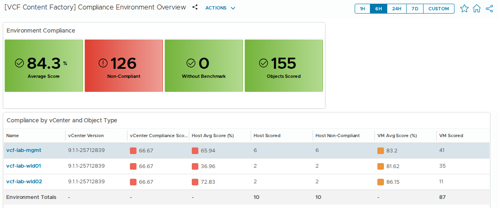
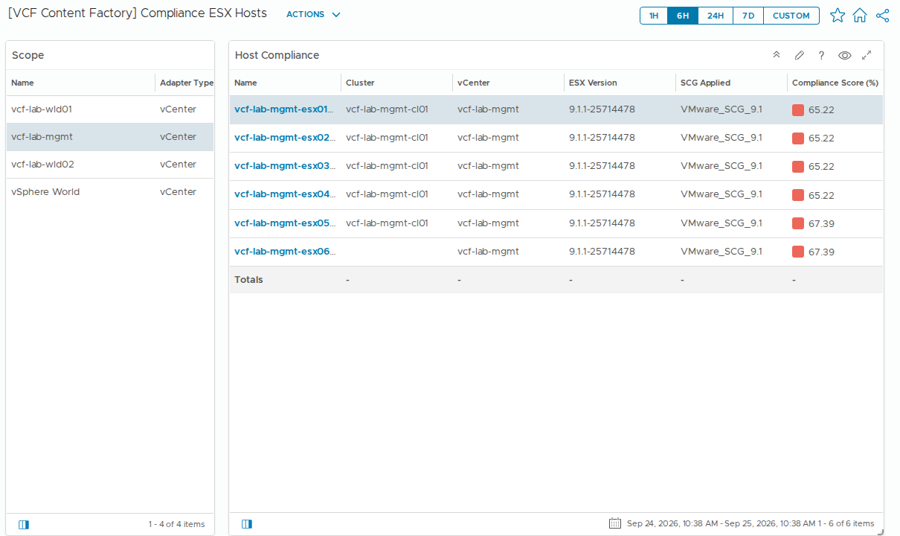
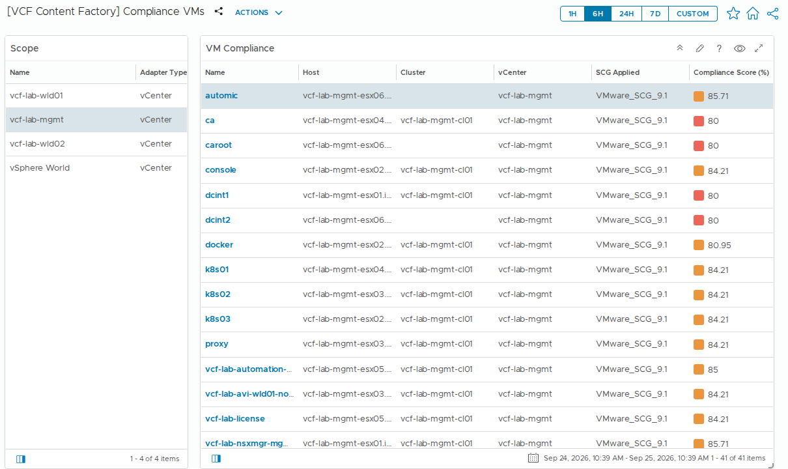
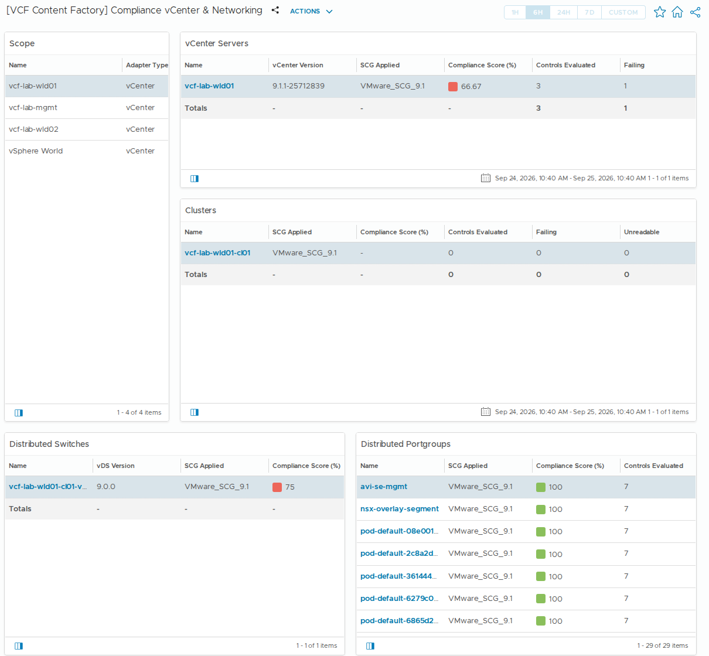

# Compliance for VCF Operations

See how your vSphere environment measures up against VMware's Security
Configuration Guide, right inside VCF Operations.

This management pack reads the security settings on your ESX hosts, VMs,
vCenter, vSAN clusters, and distributed switches and portgroups. It checks
each one against the VMware Security Configuration Guide (SCG) written for
that object's version. The results show up on objects you already monitor:
every one gets a compliance score, every failing control raises its own
alert with VMware's fix attached, and four dashboards give you the big
picture and let you drill down.

The pack only reads. It never changes a setting.

## What it does for you

**Puts a score on everything you already monitor.** Hosts, VMs,
vCenters, vSAN clusters, switches and portgroups each get a score from 0
to 100 (an object with no guide for its version, or a cluster without
vSAN, has nothing to score and shows none). Open
any of them in VCF Operations, go to All Metrics, then VCF-CF Compliance,
and you'll see each control with the value the SCG expects next to the
value that's actually set. You don't have to learn a separate object tree
or leave the pages you already use.

**Uses the right guide for each object.** Most environments are a mix of
versions. By default the pack matches each object to its own guide: hosts
by their ESX version, VMs by their host's version, and everything else by
the vCenter version. The SCG for 6.7, 7.0, 8.0, 9.0 and 9.1 is bundled.
If an object runs a version with no guide yet, it's reported as "no
benchmark" rather than scored against the wrong one. You can also pin
every object to one guide, or bring your own list of controls as a CSV.

**Turns failures into a to-do list.** Each failing control raises its own
alert, named after the control, with VMware's remediation text as the
recommendation. Severity follows the SCG's priority (P0 is Critical, P1
Immediate, P2 Warning), so your alert list sorts itself into what to fix
first.

**Tells you when it couldn't check.** If the pack can't read a setting,
because of permissions, connectivity or an unsupported read method, that
setting counts against the score instead of being quietly treated as
fine. A "Compliance data not collected" alert tells you which object is
affected and what to look at. (One known gap: a setting that is simply
absent is currently skipped rather than failed; see Known issues.)

## The dashboards

Four dashboards install with the pack. These screenshots come from a lab
with three vCenters.

**Environment Overview** is the landing page: the average score, how many
objects are non-compliant, how many have no guide for their version, and
how each vCenter is doing broken down by object type. Further down it
shows how many objects are on each SCG version, the score trend and the
open compliance alerts (both of those have open bugs; see Known issues).

**ESX Hosts** starts with a scope. Pick a vCenter, or all of vSphere,
and its hosts are listed worst first with their version, the guide
applied and the score. Select a host to see its trend and details.

**VMs** works the same way, and is built to stay fast with thousands of
VMs.

**vCenter & Networking** puts the object types you have only a few of on
one page: vCenter, clusters, distributed switches and portgroups.

## Getting started

1. Download the latest `.pak` from this repo's
   [Releases](https://github.com/sentania-labs/vcf-content-factory-sdk-compliance/releases).
2. In VCF Operations, install it from **Administration > Integrations >
   Repository > Add**.
3. Add an account for **VCF Content Factory Compliance** under
   **Administration > Integrations > Accounts > Add**. Give it your
   vCenter address, using the name on the vCenter's certificate rather
   than its IP, and a vCenter account with read access (see
   [installing.md](docs/installing.md) for the exact privileges). Leave
   the compliance profile at `Auto (by version)`.
4. Click **Validate Connection**. If it fails with a certificate error
   (common with a private CA or a self-signed vCenter certificate), set
   **Allow Insecure SSL** to `true` for now. A version that lets you
   accept the certificate from that dialog instead is in progress.
5. Enable the four compliance super metrics in the policy that applies to
   vSphere World. The overview's score tiles and trend use them.
6. Wait. The pack collects once an hour, and the per-control alerts need
   a second collection before they fire, so give it two hours before you
   judge the results.

The full walkthrough, with permissions, ports and troubleshooting, is in
[docs/installing.md](docs/installing.md).

## Good to know

- **It never fixes anything.** There are no remediation actions. The
  alerts tell you what to change; you change it.
- **vCenter appliance settings are opt-in.** Checking the vCenter
  appliance itself (SSH, NTP, syslog, TLS profile, root password expiry,
  FIPS) requires the account to be in the vsphere.local SSO group
  `SystemConfiguration.Administrators`. That group can also change those
  settings, and VMware offers no read-only equivalent. So this is off by
  default, and those controls are listed for manual review until you
  turn it on.
- **Some controls can't be checked automatically.** Some SCG controls
  expect a written site policy rather than a value, and most vSAN
  controls need a vSAN SDK the pack doesn't have. These are reported for
  manual review and never scored. The list is in
  `profiles/UNAUDITED_CONTROLS.md`.
- **Upgrades keep your settings.** An existing account keeps the
  compliance profile it was set to, even if a new version changes the
  default. An account from before version-aware scoring with no stored
  profile keeps scoring against SCG 8.0 until you set it to
  `Auto (by version)`.

## Known issues

- [#30](https://github.com/sentania-labs/vcf-content-factory-sdk-compliance/issues/30):
  the "Failing Controls on Selected ..." panels on the ESX Hosts, VMs and
  vCenter & Networking dashboards are empty. Until it's fixed, open the
  object and look under All Metrics, VCF-CF Compliance.
- [#31](https://github.com/sentania-labs/vcf-content-factory-sdk-compliance/issues/31):
  the Open Compliance Alerts widget on the overview is empty. The alerts
  themselves are raised; see them in the Alerts list.
- [#32](https://github.com/sentania-labs/vcf-content-factory-sdk-compliance/issues/32):
  the Objects by SCG Version table only shows the 6.7, 7.0 and 8.0
  columns.
- [#15](https://github.com/sentania-labs/vcf-content-factory-sdk-compliance/issues/15):
  a few VM settings that are absent (never set) are skipped instead of
  being checked against the guide's default, which can flatter VM
  scores.

All open issues are on the
[issue list](https://github.com/sentania-labs/vcf-content-factory-sdk-compliance/issues).

## More detail

- [How it works](docs/overview.md): what it reads, how scores are
  worked out, and where each result is stored.
- [Scoring, data keys and alerts](docs/data-reference.md): how a guide is
  picked, the full list of metrics and properties, and the alert
  definitions.
- [Installing and configuring](docs/installing.md)
- [Generated reference](REFERENCE.md) and the
  [inventory tree](docs/inventory-tree.md) (the pack's own object types
  and settings, generated from `describe.xml`)
- [Building from source](docs/building.md)
- [Custom profile format](CANONICAL_SCHEMA.md)
- [Changelog](CHANGELOG.md)

The bundled benchmarks come from VMware's
[vcf-security-and-compliance-guidelines](https://github.com/vmware/vcf-security-and-compliance-guidelines).
This pack is part of the
[VCF Content Factory](https://github.com/sentania-labs/vcf-content-factory).
