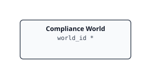

# VCF Content Factory Compliance — Documentation

> Generated index. The SVG diagram and per-kind table are regenerated on every
> build; prose sections (overview, installing) are hand-curated.

## Contents

| Section | Description |
|---------|-------------|
| [Overview](overview.md) | What's in the pack, resource kinds, cross-adapter notes |
| [Installing & Configuring](installing.md) | Prerequisites, configuration fields, step-by-step guide |
| [Inventory Tree](inventory-tree.md) | Traversal spec, per-kind table with identifying keys |
| [Metrics Reference](../REFERENCE.md) | Full metrics and properties reference (generated) |

## Inventory Tree

## Cross-MP Relationships

These edges are created at collection time via the Suite API and never appear in `describe.xml` — they are declared explicitly in `adapter.yaml` (`cross_mp_edges`) so this generated docset doesn't silently omit them. *Italic* endpoints belong to a foreign management pack; `code` endpoints are owned by this adapter.

| Parent | Child | Description |
|--------|-------|-------------|
| `ComplianceWorld` | *VMwareAdapter Instance* (foreign, VMWARE) | Each adapter instance makes its own vCenter object a child of the Compliance World through the Suite API, every cycle (additive, so instances never remove each other's links). The Rollup\|Environment totals on the Compliance World are computed by the analytics engine over these children. The link is added each cycle and never removed. |

## Quick Reference

- **Adapter kind:** `vcfcf_compliance`
- **Version:** 0.0.0.87
- **Traversal spec:** (none)
- **Resource kinds:** 1
- **Cross-MP relationships:** 1 (see [Cross-MP Relationships](#cross-mp-relationships) below)
